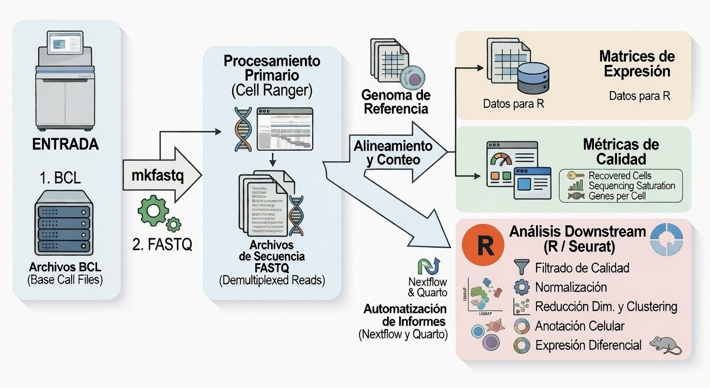

<!-- &&&&&&&&&&&&&&&&&&&&&&&&&&&&&&&&&&&&&&&&&&&&&&&&&&&&&&&&&&&&&&&&&&&&&&&&&&&&&&&&&&&&&&&&&&&&&&&&&&&&&&&&&&&&&&&&&&&&&&&&&&&&&&&&&&&&&&&&&&&&&&&&&&&&&&&&&&&&&& -->
<!--  TAB 1: METODOLOGÍA -->
<!-- &&&&&&&&&&&&&&&&&&&&&&&&&&&&&&&&&&&&&&&&&&&&&&&&&&&&&&&&&&&&&&&&&&&&&&&&&&&&&&&&&&&&&&&&&&&&&&&&&&&&&&&&&&&&&&&&&&&&&&&&&&&&&&&&&&&&&&&&&&&&&&&&&&&&&&&&&&&&&& -->


<!-- %%%%%%%%%%%%%%%%%%%%%%%%%%%%%%%%%%%%%%%%%%%%%%%%%%%%%%%%%%%%%%%%%%%%%%%%%%%%%%%%%%%%%%%%%%%%%%%%%%%%%%%%%%%%%%%%%%%%%%%%%%%%%%%%%%%%%%%%%%%% -->
<!--  CHATBOT -->
<!-- %%%%%%%%%%%%%%%%%%%%%%%%%%%%%%%%%%%%%%%%%%%%%%%%%%%%%%%%%%%%%%%%%%%%%%%%%%%%%%%%%%%%%%%%%%%%%%%%%%%%%%%%%%%%%%%%%%%%%%%%%%%%%%%%%%%%%%%%%%%% -->

```{=html}
<!-- Contenedor del chat -->
<div id="chat-container">
  <button id="chat-toggle"></button>
  <div id="chat-box">
    <div id="chat-info" class="chat-info">
      <h1>
        Mini Chat RAG (beta)
      </h1>

      <p>
        Hello! I am <strong>Geni</strong>, the intelligent assistant of <strong>GenoScribe</strong>.  
        I am here to help you interactively explore the content of this bioinformatics report.
      </p>

      <p>
        When you ask me a question, I first try to recognize whether it matches any of the patterns or expressions I know.  
        If I find a match, I will respond directly with a predefined answer, designed to be fast, clear, and even a bit witty.  
        If I do not recognize the pattern, I then activate my search tools: I generate vector representations (embeddings) and look for the most relevant fragments across multiple documents—including the report itself, external PDF and HTML files, and question-and-answer (QA) sessions.  
        Based on that information, I create a summary that aims to provide you with a coherent and useful response grounded in the existing content.
      </p>

      <p>
        Please note that this environment is experimental. I do not use large language models, so some responses may be approximate or incomplete.  
        The main goal is to provide a fast, understandable, and reproducible way to visualize the information contained in the documents, enabling a more dynamic exploration of the report.
      </p>

      <p>
        Currently, results may vary in accuracy, as I use lightweight local models to ensure the application runs in any environment without the need for external servers.  
        However, the system structure is designed to significantly improve its performance in the future through integration with more advanced models or external APIs.  
        To get started, simply type your question in the field below and let me take care of the rest. I promise to put all my code into it!
      </p>
    </div>
    <div id="chat-log"></div>
    <input id="chat-input" type="text" placeholder="Escribe tu pregunta..."/>
    <button id="chat-send" title="Enviar">
      <svg xmlns="http://www.w3.org/2000/svg" viewBox="0 0 24 24">
        <path d="M2 21l21-9L2 3v7l15 2-15 2v7z"/>
      </svg>
    </button>
  </div>
</div>
```


<!-- %%%%%%%%%%%%%%%%%%%%%%%%%%%%%%%%%%%%%%%%%%%%%%%%%%%%%%%%%%%%%%%%%%%%%%%%%%%%%%%%%%%%%%%%%%%%%%%%%%%%%%%%%%%%%%%%%%%%%%%%%%%%%%%%%%%%%%%%%%%% -->
<!--  IMPORTACIONES -->
<!-- %%%%%%%%%%%%%%%%%%%%%%%%%%%%%%%%%%%%%%%%%%%%%%%%%%%%%%%%%%%%%%%%%%%%%%%%%%%%%%%%%%%%%%%%%%%%%%%%%%%%%%%%%%%%%%%%%%%%%%%%%%%%%%%%%%%%%%%%%%%% -->

<!-- Incluir Font Awesome -->
<link href="https://cdnjs.cloudflare.com/ajax/libs/font-awesome/6.5.0/css/all.min.css" rel="stylesheet">


<!-- %%%%%%%%%%%%%%%%%%%%%%%%%%%%%%%%%%%%%%%%%%%%%%%%%%%%%%%%%%%%%%%%%%%%%%%%%%%%%%%%%%%%%%%%%%%%%%%%%%%%%%%%%%%%%%%%%%%%%%%%%%%%%%%%%%%%%%%%%%%% -->
<!--  CÓDIGO GLOBAL -->
<!-- %%%%%%%%%%%%%%%%%%%%%%%%%%%%%%%%%%%%%%%%%%%%%%%%%%%%%%%%%%%%%%%%%%%%%%%%%%%%%%%%%%%%%%%%%%%%%%%%%%%%%%%%%%%%%%%%%%%%%%%%%%%%%%%%%%%%%%%%%%%% -->

```{r, echo=FALSE, warning=FALSE, message=FALSE, results="hide"}
#===================================================================================================================================================
# CARGA DE LIBRERÍAS
#===================================================================================================================================================

library(glue)
library(fs)
library(stringr)
library(dplyr)
library(tools)


#===================================================================================================================================================
# CONFIGURACIONES INICIALES
#===================================================================================================================================================

# Rutas clave
ruta_qmd <- getwd()
ruta_sc_rna_seq_pipeline <- file.path("..", "..", "..", "..", "..", "..", "..")
ruta_sc_rna_seq_pipeline_absoluta <- normalizePath(ruta_sc_rna_seq_pipeline)
nombre_proyecto <- basename(params$project_path)


# Rutas del directorio de resultados de Nextflow
ruta_nextflow_results <- file.path(ruta_sc_rna_seq_pipeline, "resources", "02-nextflow-results")

# Rutas del directorio de datos del proyecto
ruta_proyecto <- file.path(params$project_path)
ruta_proyecto_relativa <- file.path(ruta_sc_rna_seq_pipeline, "resources", "02-nextflow-results", "01-project-data", nombre_proyecto)


# Rutas de resources
ruta_archives <- file.path(ruta_sc_rna_seq_pipeline, "resources", "01-essential", "02-archives")
ruta_archives_metodologia <- file.path(ruta_archives, "02-tmp", "tab1-metodologia")
ruta_archives_metodologia_nxqt <- file.path(ruta_archives_metodologia, "nexflow-quarto")


# Asegurarse de crear directorio
dir.create(ruta_archives_metodologia_nxqt)


#===================================================================================================================================================
# ARCHIVOS DE QUARTO Y NEXTFLOW
#===================================================================================================================================================

# Ruta de archivos en la raíz del proyecto
ruta_main_nf_absoluta <- file.path(ruta_sc_rna_seq_pipeline_absoluta, "main.nf")
ruta_main_nf <- file.path(ruta_sc_rna_seq_pipeline, "main.nf")
ruta_main_nf_archives <- file.path(ruta_archives_metodologia_nxqt, "main.nf")

ruta_nextflow_config_absoluta <- file.path(ruta_sc_rna_seq_pipeline_absoluta, "nextflow.config")
ruta_nextflow_config <- file.path(ruta_sc_rna_seq_pipeline, "nextflow.config")
ruta_nextflow_config_archives <- file.path(ruta_archives_metodologia_nxqt, "nextflow.config")

ruta_params_yml_absoluta <- file.path(ruta_sc_rna_seq_pipeline_absoluta, "params.yml")
ruta_params_yml <- file.path(ruta_sc_rna_seq_pipeline, "params.yml")
ruta_params_yml_archives <- file.path(ruta_archives_metodologia_nxqt, "params.yml")

ruta_quarto_yml_absoluta <- file.path(ruta_sc_rna_seq_pipeline_absoluta, "_quarto.yml")
ruta_quarto_yml <- file.path(ruta_sc_rna_seq_pipeline, "_quarto.yml")
ruta_quarto_yml_archives <- file.path(ruta_archives_metodologia_nxqt, "_quarto.yml")


# Copiar archivos de la raiz del poryecto
file.copy(from = ruta_main_nf_absoluta, to = ruta_main_nf_archives, overwrite = TRUE)
file.copy(from = ruta_nextflow_config_absoluta, to = ruta_nextflow_config_archives, overwrite = TRUE)
file.copy(from = ruta_params_yml_absoluta, to = ruta_params_yml_archives, overwrite = TRUE)
file.copy(from = ruta_quarto_yml_absoluta, to = ruta_quarto_yml_archives, overwrite = TRUE)


# Vector con las rutas de los archivos copiados
archivos_copiados <- c(
  ruta_main_nf_archives,
  ruta_nextflow_config_archives,
  ruta_params_yml_archives,
  ruta_quarto_yml_archives
)

# Función auxiliar para cambiar extensión a "_txt"
cambiar_a_txt <- function(ruta_original) {
  # Quita la extensión original y añade "_txt.txt"
  ruta_sin_ext <- sub("\\.[^.]+$", "", ruta_original)
  ruta_nueva <- paste0(ruta_sin_ext, ".txt")
  return(ruta_nueva)
}

# Crear los nuevos archivos .txt
for (archivo in archivos_copiados) {
  # Leer contenido original
  contenido <- readLines(archivo, warn = FALSE)
  # Definir nueva ruta con _txt
  nueva_ruta <- cambiar_a_txt(archivo)
  # Escribir contenido en el nuevo archivo
  writeLines(contenido, nueva_ruta)
}


# Definir nuevas rutas de archivos modificados a .txt
ruta_main_txt_archives <- file.path(ruta_archives_metodologia_nxqt, "main.txt")
ruta_nextflow_txt_archives <- file.path(ruta_archives_metodologia_nxqt, "nextflow.txt")
ruta_params_txt_archives <- file.path(ruta_archives_metodologia_nxqt, "params.txt")
ruta_quarto_txt_archives <- file.path(ruta_archives_metodologia_nxqt, "_quarto.txt")


#===================================================================================================================================================
# SCRIPS DE R DEL PROYECTO
#===================================================================================================================================================

# Ruta scripts de R principales
ruta_scripts_main <- file.path(params$project_path, "scripts", "01_main")
ruta_scripts_main_relativa <- file.path(ruta_proyecto_relativa, "scripts", "01_main")

# Ruta scripts de R de funciones empleadas
ruta_scripts_functions <- file.path(params$project_path, "scripts", "02_functions")
ruta_scripts_functions_relativa <- file.path(ruta_proyecto_relativa, "scripts", "02_functions")

# Crear objetos con las rutas relativas de los archivos .R
list_scripts_main <- list.files(ruta_scripts_main_relativa, pattern = "\\.[Rr]$", full.names = TRUE)
list_scripts_functions <- list.files(ruta_scripts_functions_relativa, pattern = "\\.[Rr]$", full.names = TRUE)


# Rutas de los archivos copiados a la carpeta metodologia para mostrar en el informe
ruta_archives_metodologia_scripts_main <- file.path(ruta_archives_metodologia, "scripts-main")
ruta_archives_metodologia_scripts_functions <- file.path(ruta_archives_metodologia, "scripts-functions")


# Asegurarse de que el directorio de archivos de scripts existe
dir.create(ruta_archives_metodologia_scripts_main)
dir.create(ruta_archives_metodologia_scripts_functions)


# Copiar scripts principales a la carpeta de metodología
file.copy(from = list_scripts_main, to = ruta_archives_metodologia_scripts_main, overwrite = TRUE)

# Copiar scripts de funciones a la carpeta de metodología
file.copy(from = list_scripts_functions, to = ruta_archives_metodologia_scripts_functions, overwrite = TRUE)


# Crear objetos con las rutas relativas de los archivos .R en la carpeta de metodología
list_archives_metodologia_scripts_main <- list.files(ruta_archives_metodologia_scripts_main, pattern = "\\.[Rr]$", full.names = TRUE)
list_archives_metodologia_scripts_functions <- list.files(ruta_archives_metodologia_scripts_functions, pattern = "\\.[Rr]$", full.names = TRUE)


# Crear los nuevos archivos .txt de scripts principales
for (archivo in list_archives_metodologia_scripts_main) {
  # Leer contenido original
  contenido <- readLines(archivo, warn = FALSE)
  # Definir nueva ruta con _txt
  nueva_ruta <- cambiar_a_txt(archivo)
  # Escribir contenido en el nuevo archivo
  writeLines(contenido, nueva_ruta)
}

# Crear los nuevos archivos .txt de scripts de funciones
for (archivo in list_archives_metodologia_scripts_functions) {
  # Leer contenido original
  contenido <- readLines(archivo, warn = FALSE)
  # Definir nueva ruta con _txt
  nueva_ruta <- cambiar_a_txt(archivo)
  # Escribir contenido en el nuevo archivo
  writeLines(contenido, nueva_ruta)
}


# Definir nuevas rutas de archivos modificados a .txt
list_archives_metodologia_scripts_main_txt <- 
  list.files(ruta_archives_metodologia_scripts_main, 
              pattern = "\\.txt$", 
              full.names = TRUE,
              ignore.case = TRUE)

list_archives_metodologia_scripts_functions_txt <- 
  list.files(ruta_archives_metodologia_scripts_functions, 
              pattern = "\\.txt$", 
              full.names = TRUE,
              ignore.case = TRUE)
```


<!-- %%%%%%%%%%%%%%%%%%%%%%%%%%%%%%%%%%%%%%%%%%%%%%%%%%%%%%%%%%%%%%%%%%%%%%%%%%%%%%%%%%%%%%%%%%%%%%%%%%%%%%%%%%%%%%%%%%%%%%%%%%%%%%%%%%%%%%%%%%%% -->
<!--  TÍTULO Y RESUMEN CONTEXTUAL -->
<!-- %%%%%%%%%%%%%%%%%%%%%%%%%%%%%%%%%%%%%%%%%%%%%%%%%%%%%%%%%%%%%%%%%%%%%%%%%%%%%%%%%%%%%%%%%%%%%%%%%%%%%%%%%%%%%%%%%%%%%%%%%%%%%%%%%%%%%%%%%%%% -->

<div class="informe-titulo-tab-unique">
  <h1>Tab</h1>
  <h2>Methodology and Tools</h2>
</div>

<div class="flecha-abajo">
  ▼
</div>


<div class="informe-resumen">
  <h2>Summary</h2>

  <p>
    This tab is primarily technical and documents how the report was generated, which data were used, which tools were involved, and how the workflow was organized. Its purpose is to allow any reader of this report to understand the procedures performed, verify the results, and, if desired, reproduce the complete analysis accurately.
  </p>

  <p>
    During the preparation of the report, the following execution parameters are provided:
  </p>

  <ul>
    <li><strong>project_path</strong> &rArr; path containing the results of the complete bioinformatics analysis previously performed.</li>
    <li><strong>report_language</strong> &rArr; language of the report, which can be <code>Spanish</code> or <code>English</code>.</li>
    <li><strong>report_version</strong> &rArr; defines the version of the report to be generated, which can be <code>Full</code> or <code>Compact</code>.</li>
  </ul>

  <p>
    The report data originate from a comprehensive analysis starting from raw sequencing files (<code>BCL</code>). In an initial phase, the <strong>Cell Ranger</strong> (10x Genomics) pipeline is used for demultiplexing and conversion to <code>FASTQ</code> format. Next, the same tool performs alignment against the reference genome and primary quality control, generating automated reports (<em>web summaries</em>) and expression count matrices (files <code>.h5</code>). Subsequently, these matrices are imported into the <strong>R programming language</strong>, where the downstream analysis is carried out primarily using the <strong>Seurat</strong> package. This workflow covers rigorous single-cell filtering (QC), dimensionality reduction and clustering, expert annotation of populations, and differential expression analysis between conditions, ensuring a thorough and reproducible workflow.
  </p>

  <p>
    Once the bioinformatics analysis is complete, <strong>Nextflow</strong> organizes the results and prepares configuration files that serve as an interface with <strong>Quarto</strong>:
  </p>
  
  <ul>
    <li><strong><code>params.yml</code></strong> &rArr; contains execution-specific parameters, paths to results, report version, and display options.</li>
    <li><strong><code>_quarto.yml</code></strong> &rArr; defines the structure of the report, including templates, tabs, sections, and internal paths, generated using <code>yaml_generator.py</code>.</li>
  </ul>

  <p>
    When all previous processes are finished, Nextflow invokes <code>quarto render</code>, generating the final HTML report in the <code>report/</code> folder. This workflow ensures that the document fully, consistently, and reproducibly reflects all single-cell transcriptomic results.
  </p>

  <p>
    Thanks to this modular architecture:
  </p>

  <ul>
    <li>Each stage of the analysis (read processing, cell quality control, mathematical clustering, biological annotation, differential expression, and report generation) can be executed independently or jointly.</li>
    <li>It allows processing multiple experiments within the same root folder without compromising traceability or reproducibility.</li>
    <li>Verification and reconstruction of the report in the future with the same data and parameters are facilitated.</li>
  </ul>

  <p>
    Additionally, this tab includes references to manuals, repositories, and supplementary documentation, accessible via information cards. For any questions or additional support, contact information is provided on the home tab.
  </p>
</div>


<!-- %%%%%%%%%%%%%%%%%%%%%%%%%%%%%%%%%%%%%%%%%%%%%%%%%%%%%%%%%%%%%%%%%%%%%%%%%%%%%%%%%%%%%%%%%%%%%%%%%%%%%%%%%%%%%%%%%%%%%%%%%%%%%%%%%%%%%%%%%%%% -->
<!--  TABLA DE CONTENIDOS -->
<!-- %%%%%%%%%%%%%%%%%%%%%%%%%%%%%%%%%%%%%%%%%%%%%%%%%%%%%%%%%%%%%%%%%%%%%%%%%%%%%%%%%%%%%%%%%%%%%%%%%%%%%%%%%%%%%%%%%%%%%%%%%%%%%%%%%%%%%%%%%%%% -->

<div style="height: 15px; background-color: transparent;"></div>

<div class="titulo-toc">
  Table of contents for this tab
</div>

<div class="toc">
  <ul>
    <li>
      <a href="#tab1-intro">Methodology and tools</a>
      <ul>
        <li>
          <a href="#tab1-seccion1">1<span>.</span> Software and tools used in the analysis</a>
          <ul>
            <li><a href="#tab1-seccion1.1">1.1. Primary processing with Cell Ranger (10x Genomics)</a></li>
            <li><a href="#tab1-seccion1.2">1.2. Single-cell transcriptomic analysis with R (Seurat)</a></li>
          </ul>
        </li>
        <li><a href="#tab1-seccion2">2<span>.</span> Data structure and generated results</a></li>
        <li>
          <a href="#tab1-seccion3">3<span>.</span> Automated report generation</a>
          <ul>
            <li><a href="#tab1-seccion3.1">3.1. Execution directory structure</a></li>
            <li><a href="#tab1-seccion3.2">3.2. Integration of Nextflow and Quarto</a></li>
            <li><a href="#tab1-seccion3.3">3.3. Configuration of _quarto.yml and params.yml files</a></li>
          </ul>
        </li>
        <li>
          <a href="#tab1-seccion4">4<span>.</span> Manuals, repositories, and supplementary documentation</a>
        </li>
      </ul>
    </li>
  </ul>
</div>


<!-- %%%%%%%%%%%%%%%%%%%%%%%%%%%%%%%%%%%%%%%%%%%%%%%%%%%%%%%%%%%%%%%%%%%%%%%%%%%%%%%%%%%%%%%%%%%%%%%%%%%%%%%%%%%%%%%%%%%%%%%%%%%%%%%%%%%%%%%%%%%% -->
<!--  REDACCIÓN -->
<!-- %%%%%%%%%%%%%%%%%%%%%%%%%%%%%%%%%%%%%%%%%%%%%%%%%%%%%%%%%%%%%%%%%%%%%%%%%%%%%%%%%%%%%%%%%%%%%%%%%%%%%%%%%%%%%%%%%%%%%%%%%%%%%%%%%%%%%%%%%%%% -->

<div style="height: 25px; background-color: transparent;"></div>

<div class="titulo1" id="tab1-intro">
  Methodology and tools
</div>

<p>
  This section details the technical and methodological framework underlying the generation of this report, ensuring full <strong>transparency</strong> and <strong>reproducibility</strong> of the analysis. The objective is to comprehensively document the workflow, from the bioinformatic processing of raw data to the automated rendering of the final document, allowing any user to understand, audit, and replicate the exact process.
</p>

<p>
  In section <strong>1. Software and tools used in the analysis</strong>, the main pipeline is described, which includes the primary processing of reads using <strong>Cell Ranger (10x Genomics)</strong> and the subsequent single cell transcriptomic analysis using the <strong>Seurat</strong> package in the <strong>R</strong> programming environment. Next, in <strong>2. Structure of the data and generated results</strong>, the organization of the output directories and the key files resulting from the experiment is detailed. 
</p>

<p>
  Section <strong>3. Automated report generation</strong> explores the modular architecture of the system in depth, explaining step by step how <strong>Nextflow</strong> manages execution directories and interacts with <strong>Quarto</strong> through essential configuration files such as <code>params.yml</code> and <code>_quarto.yml</code>. Finally, section <strong>4. Manuals, repositories, and complementary documentation</strong> provides direct access to the official technical resources of the tools used to facilitate further consultation.
</p>


<div style="height: 20px; background-color: transparent;"></div>

<div class="titulo2" id="tab1-seccion1">
  1<span>.</span> Software and tools used in the analysis
</div>

<p>
  The Single-Cell RNA-Seq (scRNA-Seq) analysis performed in this study is based on a two-phase computational architecture. This separation allows efficient handling of the enormous initial computational load and subsequently the application of high-resolution interactive statistical algorithms.
</p>

<p>
  First, the official <strong>Cell Ranger</strong> pipeline (developed by <em>10x Genomics</em>) is used for primary processing of raw reads, ensuring proper demultiplexing and alignment against the reference genome. Second, the downstream (secondary and tertiary) analysis is carried out entirely in the <strong>R programming language</strong>, relying heavily on the <strong>Seurat</strong> package, the current industry standard for single-cell analysis.
</p>

<p>
  The following sections describe these two methodological stages in detail, the types of results they generate, and, in the case of the R analysis, include the scripts used to ensure full traceability and reproducibility of the experiment.
</p>


<div style="height: 15x; background-color: transparent;"></div>

<div class="titulo3" id="tab1-seccion1.1">
  1.1. Primary Processing with Cell Ranger (10x Genomics)
</div>

<p>
  <strong>Cell Ranger</strong> represents the official computational standard developed by 10x Genomics to process data from their Chromium microfluidic technology. In this project, the initial (<em>upstream</em>) processing was executed automatically on high-performance computing (HPC) infrastructures, acting as the direct bridge between the raw sequencer signal and the mathematical matrices of cellular expression.
</p>

<p>
  A critical and unavoidable prerequisite for the success of this phase is the availability of a high-resolution genomic architecture. The process absolutely depends on two structured files provided or agreed upon with the researcher: the full genome sequence (in <code>.fasta</code> format) and its transcriptional annotation (in <code>.gtf</code> or <code>.gff</code> format). This annotation serves as the biological "coordinate map"; its quality and degree of update directly dictate what percentage of genomic reads will translate into detectable genes and how much information will be lost in unannotated intergenic regions.
</p>

<p>
  The key algorithmic stages executed by this tool are divided into:
</p>

<ol>
  <li>
    <strong>Reference Construction (mkref)</strong> &rArr; Computational indexing of the provided <code>.fasta</code> and <code>.gtf</code> files, creating an optimized and filtered mapping environment (e.g., restricting quantification to coding genes or biotypes of interest).
  </li>
  <li>
    <strong>Demultiplexing (mkfastq)</strong> &rArr; Conversion of raw binary files (<em>Base Call Files</em> or <code>BCL</code>) emitted by the Illumina sequencer into readable text sequences (<code>FASTQ</code> files), mathematically separating project samples based on their molecular indices.
  </li>
  <li>
    <strong>Alignment and Quantification (count)</strong> &rArr; Mapping of millions of <code>FASTQ</code> reads against the reference genome using the <em>STAR aligner</em> algorithm. In this ultra-complex step, cellular barcode errors (<em>Cell Barcodes</em>, which identify the cell of origin for each read) are corrected and unique molecular identifiers (<em>UMIs</em>, to remove exact PCR duplicates) are collapsed.
  </li>
  <li>
    <strong>Topological Matrix Generation</strong> &rArr; After counting actual molecules, feature-barcode expression matrices (<em>Feature-Barcode matrices</em>) are built. They are exported both in high-compression optimized <code>.h5</code> (HDF5) format and in the open MEX format (<em>Market Exchange Format</em>).
  </li>
  <li>
    <strong>Primary Quality Control</strong> &rArr; Automatic generation of HTML reports (<em>Web Summaries</em>) that audit sequencing health, detailing vital success metrics such as the fraction of reads in cells, saturation depth, and median genes captured per lipid droplet.
  </li>
</ol>

<p>
  Since <em>Cell Ranger</em> is a closed sequential <em>pipeline</em> highly calibrated by the manufacturer, the purified mathematical matrices at this stage constitute the unmovable "clay block" upon which all subsequent biological analysis in <code>R/Seurat</code> will be sculpted. Below is a schematic representation of this data acquisition workflow:
</p>

<div class="box-images">
  
</div>

<div style="display: flex; justify-content: center; gap: 25px;">
  <a href="../../../../../01-images/tab1-metodologia/cellranger_workflow.png" 
    target="_blank" 
    class="boton-image">
    <i class="fa-solid fa-sitemap"></i> View schematic in a new page
  </a>
  
  <a href="../../../../../01-images/tab1-metodologia/cellranger_workflow.png" 
    download="cellranger_workflow.png"
    class="boton-image-download">
    <i class="fa-solid fa-file-arrow-down"></i> Download image
  </a>
</div>


<div style="height: 15x; background-color: transparent;"></div>

<div class="titulo3" id="tab1-seccion1.2">
  1.2. Cellular Transcriptomic Analysis with R (Seurat)
</div>

<p>
  Once the count matrices (<code>.h5</code>) were obtained from Cell Ranger, the <em>downstream</em> analysis was moved to the <strong>R</strong> ecosystem. The main tool used for single-cell processing is <strong>Seurat</strong>, complemented by accessory libraries for visualization, annotation, and statistical computation.
</p>

<p>
  The analysis using custom R scripts covers the following critical phases:
</p>

<ul>
  <li><strong>Cell Filtering and QC:</strong> Removal of low-quality cells (high mitochondrial percentage) or potential doublets (excess detected genes).</li>
  <li><strong>Normalization and Integration:</strong> Standardization of gene expression and application of mathematical integration algorithms to correct for potential batch effects or imbalances in the number of cells captured between conditions (downsampling).</li>
  <li><strong>Dimensionality Reduction and Clustering:</strong> Calculation of principal components (PCA), projection onto nonlinear maps (UMAP), and blind clustering using shared nearest neighbor (SNN) graph algorithms.</li>
  <li><strong>Annotation:</strong> Cross-referencing expression profiles with public databases (Tabula Muris, HPCA) and manual expert curation based on canonical markers.</li>
  <li><strong>Differential Expression:</strong> Paired or condition-specific statistical contrasts (e.g., WT vs KO) within each annotated cellular subpopulation.</li>
</ul>

<p>
  To ensure <strong>reproducibility</strong> and allow technical inspection of the code by other bioinformaticians, direct access is provided below to the main analytical scripts developed for this experiment, as well as to the auxiliary functions used throughout the workflow.
</p>


<div style="height: 12x; background-color: transparent;"></div>

<div class="titulo4" id="tab1-seccion1.2.1">
  1.2.1. Main Analytical Scripts
</div>

<p>
  The executable scripts containing the main sequential workflow (processing, clustering, annotation, and DEGs) are located in the directory:
</p>

```{r, results="asis"}
cat(glue::glue(' 
<p><code>{ruta_scripts_main}</code></p>
\n\n'))

```

<p>
  The files contained in this directory are listed below:
</p>

```{r, results="asis"}
if (!dir.exists(ruta_scripts_main)) {
  cat(sprintf('<p><em>The path "%s" does not exist or is not accessible.</em></p>\n', ruta_scripts_main))
} else {
  # Listar archivos y carpetas en la ruta
  files <- list.files(ruta_scripts_main_relativa, full.names = FALSE)
  files <- files[!grepl("(_cache|_libs|\\.html$)", files)]
  
  if (length(files) == 0) {
    cat('<p><em>No files were found in the specified folder.</em></p>\n')
  } else {
    carpetas <- files[file.info(file.path(ruta_scripts_main_relativa, files))$isdir]
    archivos <- setdiff(files, carpetas)
    
    carpetas <- sort(carpetas)
    archivos <- sort(archivos)
    files_ordenados <- c(carpetas, archivos)

    cat("<ul class='box-files'>\n")
    for (f in files_ordenados) {
      ruta_f <- file.path(ruta_scripts_main_relativa, f)
      es_dir <- file.info(ruta_f)$isdir

      clase <- "file-default"
      if (es_dir) {
        clase <- "file-folder"
      } else if (grepl("\\.R$", f, ignore.case = TRUE)) {
        clase <- "file-code"
      } else if (grepl("\\.sh$", f, ignore.case = TRUE)) {
        clase <- "file-sh"
      }
      cat(sprintf('<li class="%s">%s</li>\n', clase, f))
    }
    cat("</ul>\n")
  }
}
```

```{r, results="asis"}
# Imprimir el botón para explorar la carpeta
cat(glue::glue('
<p style="text-align:center; margin-bottom: 30px;">
  <a href="{ruta_scripts_main_relativa}" target="_blank" class="boton-files">
    <i class="fa-solid fa-folder-open"></i> Explore the files in the folder "{basename(ruta_scripts_main)}" here
  </a>
</p>
\n\n'))
```

<p>
  Once these files are displayed, their source code is shown one by one. You can review them conveniently from this same window or download them for execution.
</p>

```{r, results="asis"}
if (length(list_scripts_main) > 0) {
  # Bucle para recorrer el objeto y mostrar cada script directamente
  for (archivo in list_scripts_main) {
    nombre_base <- basename(archivo)

    # Quitar extensión
    nombre_sin_ext <- tools::file_path_sans_ext(nombre_base)

    # Reconstruir cada ruta con su extensión correcta
    ruta_relativa <- file.path(ruta_scripts_main_relativa, paste0(nombre_sin_ext, ".R"))
    ruta_relativa_txt <- file.path(ruta_archives_metodologia_scripts_main, paste0(nombre_sin_ext, ".txt"))
    
    cat(glue::glue('
    <p style="margin-top: 10px; margin-bottom: -10px;">
      <i class="fa-brands fa-r-project" style="color: #276DC3;"></i> 
      <strong>Auxiliary script:</strong> <code>{nombre_base}</code>
    </p>
    
    <!-- IFRAME para nextflow.config -->
    <div class="iframe-container">
      <iframe src="{ruta_relativa_txt}" frameborder="0" style="height: 500px;"></iframe>
    </div>

    <div style="display: flex; justify-content: center; gap: 25px;">
      <a href="{ruta_relativa_txt}"
        target="_blank" 
        class="boton-iframe">
        <i class="fa-solid fa-file-lines"></i> View full file in a new page
      </a>

      <a href="{ruta_relativa}"
        download="{nombre_base}"
        class="boton-iframe-download">
        <i class="fa-solid fa-file-arrow-down"></i> Download file
      </a>
    </div>
    '), sep = "\n")
  }

} else {
  cat(glue::glue('
  <div class="alert-warning alert-box">
    <i class="fa-solid fa-triangle-exclamation"></i>
    <b>Warning</b><br>
    No <code>.R</code> scripts were found in the specified directory:  
    <code>{ruta_scripts_main}</code>.
  </div>
  \n\n'))
}
```


<div style="height: 12px; background-color: transparent;"></div>

<div class="titulo4" id="tab1-seccion1.2.2">
  1.2.2. Auxiliary Function Scripts
</div>

<p>
  In addition to the main workflows, the analysis relies on predefined and modular complex functions (such as generating plots or repetitive statistical calculations). These files are grouped in the following directory:
</p>

```{r, results="asis"}
cat(glue::glue(' 
<p><code>{ruta_scripts_functions}</code></p>
\n\n'))
```

```{r, results="asis"}
if (!dir.exists(ruta_scripts_functions_relativa)) {
  cat(sprintf('<p><em>The path "%s" does not exist or is not accessible.</em></p>\n', ruta_scripts_functions))
} else {
  files_func <- list.files(ruta_scripts_functions_relativa, full.names = FALSE)
  files_func <- files_func[!grepl("(_cache|_libs|\\.html$)", files_func)]
  
  if (length(files_func) == 0) {
    cat('<p><em>The functions folder is empty.</em></p>\n')
  } else {
    carpetas_f <- files_func[file.info(file.path(ruta_scripts_functions_relativa, files_func))$isdir]
    archivos_f <- setdiff(files_func, carpetas_f)
    
    carpetas_f <- sort(carpetas_f)
    archivos_f <- sort(archivos_f)
    files_ordenados_f <- c(carpetas_f, archivos_f)

    cat("<ul class='box-files'>\n")
    for (f in files_ordenados_f) {
      ruta_f <- file.path(ruta_scripts_functions_relativa, f)
      es_dir <- file.info(ruta_f)$isdir

      clase <- "file-default"
      if (es_dir) {
        clase <- "file-folder"
      } else if (grepl("\\.R$", f, ignore.case = TRUE)) {
        clase <- "file-code"
      }
      cat(sprintf('<li class="%s">%s</li>\n', clase, f))
    }
    cat("</ul>\n")
  }
}
```

```{r, results="asis"}
# Imprimir el botón para explorar la carpeta
cat(glue::glue('
<p style="text-align:center; margin-bottom: 30px;">
  <a href="{ruta_scripts_functions_relativa}" target="_blank" class="boton-files">
    <i class="fa-solid fa-folder-open"></i> Explore the files in the folder "{basename(ruta_scripts_functions)}" here
  </a>
</p>
\n\n'))
```

<p>
  Once these files are displayed, their source code is shown one by one (if there are multiple). You can review them conveniently from this same window or download them for execution.
</p>

```{r, results="asis"}
if (length(list_scripts_functions) > 0) {
  # Bucle para recorrer el objeto y mostrar cada script directamente
  for (archivo in list_scripts_functions) {
    nombre_base <- basename(archivo)

    # Quitar extensión
    nombre_sin_ext <- tools::file_path_sans_ext(nombre_base)

    # Reconstruir cada ruta con su extensión correcta
    ruta_relativa <- file.path(ruta_scripts_functions_relativa, paste0(nombre_sin_ext, ".R"))
    ruta_relativa_txt <- file.path(ruta_archives_metodologia_scripts_functions, paste0(nombre_sin_ext, ".txt"))
    
    cat(glue::glue('
    <p style="margin-top: 10px; margin-bottom: -10px;">
      <i class="fa-brands fa-r-project" style="color: #276DC3;"></i> 
      <strong>Main script:</strong> <code>{nombre_base}</code>
    </p>

    <!-- IFRAME for nextflow.config -->
    <div class="iframe-container">
      <iframe src="{ruta_relativa_txt}" frameborder="0" style="height: 500px;"></iframe>
    </div>

    <div style="display: flex; justify-content: center; gap: 25px;">
      <a href="{ruta_relativa_txt}"
        target="_blank" 
        class="boton-iframe">
        <i class="fa-solid fa-file-lines"></i> View full file in a new page
      </a>

      <a href="{ruta_relativa}"
        download="{nombre_base}"
        class="boton-iframe-download">
        <i class="fa-solid fa-file-arrow-down"></i> Download file
      </a>
    </div>
    '), sep = "\n")
  }

} else {
  cat(glue::glue('
  <div class="alert-warning alert-box">
    <i class="fa-solid fa-triangle-exclamation"></i>
    <b>Warning</b><br>
    No <code>.R</code> scripts were found in the specified directory:  
    <code>{ruta_scripts_functions}</code>.
  </div>
  \n\n'))
}
```


<div style="height: 20px; background-color: transparent;"></div>

<div class="titulo2" id="tab1-seccion2">
  2<span>.</span> Structure of the Data and Generated Results
</div>

<p>
  Once all stages of the <strong>Single-Cell RNA-Seq</strong> analysis workflow using the tools described above are completed, the results are organized in a <strong>directory structure</strong> that serves as the basis for generating this automated report. 
  This organization includes intermediate files, final results, and metadata associated with each pipeline module, ensuring traceability and reproducibility of the entire analysis.
</p>

<p>
  This section, like the rest of the methodology tab, has a purely technical purpose and is intended as an internal reference for the user who generated the report. Its goal is to provide an understanding of how the project output data is structured, allowing a <strong>quick review of result organization</strong> without needing to return to the original analysis environment.
</p>

<p>
  Below is the path of the main directory where the data and generated results for this project are located:
</p>

```{r, results="asis"}
cat(glue::glue('
  <code>{params$project_path}</code>'
), sep = "\n\n")
```

<p> 
  Below is the complete structure of this directory. This representation allows viewing the files and subfolders generated during the Single-Cell RNA-Seq analysis, which were used as the basis for constructing this report: 
</p>

<div class="box-files">

```{r, results="asis"}
if (!dir.exists(ruta_proyecto_relativa)) {
  cat(sprintf('<p><em>The path "%s" does not exist or is not accessible.</em></p>\n', ruta_proyecto_relativa))
} else {
  # List all files, without filters
  files <- list.files(ruta_proyecto_relativa, full.names = FALSE)
  
  if (length(files) == 0) {
    cat('<p><em>No files were found in the specified folder.</em></p>\n')
  } else {
    enlace <- ruta_proyecto_relativa
    
    cat("<ul>\n")
    for (f in files) {
      # Assign class according to extension
      clase <- if (!grepl("\\.", f)) {
        "file-folder"
      } else if (grepl("\\.html$", f)) {
        "file-html"
      } else if (grepl("\\.zip$", f)) {
        "file-zip"
      } else if (grepl("\\.fastq\\.gz$", f)) {
        "file-fastqgz"
      } else {
        "file-default"
      }
      
      cat(sprintf('<li class="%s"><a href="%s/%s" target="_blank">%s</a></li>\n',
                  clase, enlace, f, f))
    }
    cat("</ul>\n")
  }
}
```

</div>

```{r, results="asis"}
# Para que funcione con rutas absolutas
enlace <- ruta_proyecto_relativa

# Imprimir el enlace
cat(glue::glue('
<p style="text-align:center;">
  <a href="{enlace}" target="_blank" class="boton-files">
    <i class="fa-solid fa-folder-open"></i> Explore the files in the folder "{nombre_proyecto}" here
  </a>
</p>
\n\n'))
```

```{r, results="asis"}
cat(glue::glue('
<p>
  After visualizing the structure interactively, a detailed breakdown of the folders generated during the Single-Cell RNA-Seq analysis for the project <code>{nombre_proyecto}</code> is presented below.
  This standardized organization is designed to map directly the biological workflow of the cellular analysis, facilitating reproducibility and traceability of the results.
</p>

<div class="items">
<ul>
  <li>
    <strong><code>{nombre_proyecto}/data/</code></strong> <strong>&rArr;</strong> Root directory hosting all raw data, expression matrices, mathematical objects, and external resources used in the project.
    <ul>
      <li><strong><code>01_raw_blc/</code></strong> <strong>&rarr;</strong> Direct binary files from the sequencer (Illumina).</li>
      <li><strong><code>02_fastq_cellranger/</code></strong> <strong>&rarr;</strong> Primary processing results (10x Genomics), containing FASTQ files, count matrices (<code>.h5</code>), and HTML reports (web summaries) per sample.</li>
      <li><strong><code>03_processed_objects/</code></strong> <strong>&rarr;</strong> RDS files (R Data Structure) with Seurat objects generated after key filtering, integration, and annotation stages.</li>
      <li><strong><code>04_resources/</code></strong> <strong>&rarr;</strong> Additional metadata, databases (HPCA, Tabula Muris), and manual curation files (marker lists) used for cell annotation.</li>
    </ul>
  </li>

  <li>
    <strong><code>{nombre_proyecto}/scripts/</code></strong> <strong>&rArr;</strong> Repository of source code developed for the transcriptomic analysis.
    <ul>
      <li><strong><code>01_main/</code></strong> <strong>&rarr;</strong> Main execution scripts containing the Seurat workflow (processing, clustering, and DEGs).</li>
      <li><strong><code>02_functions/</code></strong> <strong>&rarr;</strong> Auxiliary R function files, customized for statistical calculations or specific visualizations.</li>
      <li><strong><code>03_extra/</code></strong> <strong>&rarr;</strong> Supplementary scripts or proof-of-concept files not included in the final pipeline.</li>
    </ul>
  </li>

  <li>
    <strong><code>{nombre_proyecto}/analysis/</code></strong> <strong>&rArr;</strong> Main results folder. Contains all graphs, tables, and statistical contrasts generated sequentially, from filtering to differential expression.
    <ul>
      <li><strong><code>01_qc/</code></strong> <strong>&rarr;</strong> Quality control structured in two levels: <code>01_reads_qc/</code> (sequencing quality with Fastp/FastQC and MultiQC) if available, and <code>02_cells_qc/</code> (violin plots and cell filtering in Seurat).</li>
      <li><strong><code>02_dim_reduction/</code></strong> <strong>&rarr;</strong> Mathematical variability plots (Elbow plots, PCA) used to determine the optimal dataset dimensions.</li>
      <li><strong><code>03_clustering/</code></strong> <strong>&rarr;</strong> Nonlinear maps (UMAP) and cell proportion plots. Systematically divided into <em>merged</em> approaches (<code>01_seurat_merged_clusters/</code>) and integrated/balanced approaches (<code>02_seurat_integrated_clusters/</code>).</li>
      <li><strong><code>04_markers/</code></strong> <strong>&rarr;</strong> Statistical tables with constitutive genes (Top Markers) calculated for each blind numeric cluster.</li>
      <li><strong><code>05_cell_annotation/</code></strong> <strong>&rarr;</strong> Biological identity phase. Contains automated annotation results (<code>01_automatic_dbs_annotation/</code>) and iterative expert curation (<code>02_manual_annotation/</code>).</li>
      <li><strong><code>06_population_aggregation/</code></strong> <strong>&rarr;</strong> Visual justification and final maps after unifying sub-stages into robust anatomical macro-populations for statistical contrasts.</li>
      <li><strong><code>07_deg_conditions/</code></strong> <strong>&rarr;</strong> Statistical core of the project. Contains tables and visualizations (Volcanos, DotPlots) of clinical differential expression (e.g., WT vs KO), structured according to cellular grouping levels (blind clusters, automatic database annotations, or final curated annotation).</li>
      <li><strong><code>08_enrichment/</code></strong> <strong>&rarr;</strong> Functional enrichment analysis of differentially expressed genes.</li>
      <li><strong><code>09_extra/</code></strong> <strong>&rarr;</strong> Specific requests, such as detailed exploration of individual genes of interest (<code>01_specific_genes_of_interest/</code>).</li>
    </ul>
  </li>
</ul>
</div>

<p>
  This modular and coherent structure not only allows automation of key bioinformatics analysis steps but also ensures traceability, reproducibility, and ease of interpretation. Additionally, it contributes to better workflow documentation, which is especially useful in collaborative environments or long-term projects.
</p>
'), sep = "\n")
```


<div style="height: 20px; background-color: transparent;"></div>

<div class="titulo2" id="tab1-seccion3">
  3<span>.</span> Automated Report Generation
</div>

<p>
  Once the data processed through the bioinformatics analysis has been obtained and the directory structure containing the generated results has been displayed, the next step is the <strong>automated generation of the final report</strong>. This section aims to clearly and reproducibly document the entire process by which the report is constructed, detailing the organization of execution files, the integration of tools, and the configuration used.
</p>

<p>
  In particular, the following aspects will be addressed:
</p>

<ul>
  <li>
    <strong>3.1. Execution Directory Structure</strong> <strong>&rArr;</strong> The location and organization of the files and folders from which the pipeline is executed will be shown, including Nextflow scripts and associated Quarto files. This allows the technical user to understand where the data, intermediate results, and configuration files needed to generate the report are located.
  </li>
  <li>
    <strong>3.2. Integration of Nextflow and Quarto</strong> <strong>&rArr;</strong> It will explain how <code>Nextflow</code> has been used to automate Quarto execution and the generation of the final report, describing the role of the main scripts (<code>main.nf</code>) and how the different stages of the pipeline are coordinated.
  </li>
  <li>
    <strong>3.3. Configuration of the <code>_quarto.yml</code> and <code>params.yml</code> files</strong> <strong>&rArr;</strong> The configuration files that allow exact reproduction of the report will be shown, including input paths, analysis parameters, and visualization options. This documentation ensures that any technical user can regenerate the report with the same results in the future, guaranteeing traceability and reproducibility.
  </li>
</ul>

<p>
  The purpose of this section is to provide a <strong>complete technical record</strong> of the workflow used to generate the report, so that anyone revisiting the project can clearly understand how the data were assembled, which tools were used, and how the entire execution environment was configured.
</p>


<div style="height: 15x; background-color: transparent;"></div>

<div class="titulo3" id="tab1-seccion3.1">
  3.1. Execution Directory Structure
</div>

<p>
  This subsection describes the <strong>file and folder structure</strong> from which the metagenomics pipeline that generates the automated report is executed. This information is essential for understanding how input data, intermediate results, and Quarto and Nextflow configuration files are organized.
</p>

<p>
  The root path from which this pipeline is executed is:
</p>

```{r, results="asis"}
cat(glue::glue('<code>{ruta_sc_rna_seq_pipeline_absoluta}</code>'), sep = "\n")
```

<p>
  Below is the complete structure of the directory corresponding to this project. It is important to note that the listed items (both files and subfolders) do not represent interactive links, but are shown solely to illustrate the internal organization of the contents. This representation allows the reader to clearly and visually understand how the different project components are distributed, facilitating conceptual navigation of the directory without needing to access each file directly.
</p>

<div class="box-files">

```{r, results="asis"}
if (!dir.exists(ruta_sc_rna_seq_pipeline_absoluta)) {
  cat(sprintf('<p><em>The path "%s" does not exist or is not accessible.</em></p>\n', ruta_sc_rna_seq_pipeline_absoluta))
} else {
  # Listar archivos y carpetas en la ruta
  files <- list.files(ruta_sc_rna_seq_pipeline_absoluta, full.names = FALSE)
  files <- files[!grepl("(_cache|_libs|\\.html$)", files)]
  
  # Identificar cuáles son carpetas
  carpetas <- files[file.info(file.path(ruta_sc_rna_seq_pipeline_absoluta, files))$isdir]
  archivos <- setdiff(files, carpetas)
  
  # Ordenar alfabéticamente si quieres
  carpetas <- sort(carpetas)
  archivos <- sort(archivos)
  
  # Reunir carpetas primero
  files <- c(carpetas, archivos)

  if (length(files) == 0) {
    cat('<p><em>No files were found in the specified folder.</em></p>\n')
  } else {
    cat("<ul class='box-files'>\n")
    for (f in files) {
      ruta_f <- file.path(ruta_sc_rna_seq_pipeline_absoluta, f)
      es_dir <- file.info(ruta_f)$isdir

      # Asignar clase según tipo
      clase <- if (es_dir) {
        "file-folder"
      } else if (grepl("\\.html?$", f, ignore.case = TRUE)) {
        "file-html"
      } else if (grepl("\\.zip$", f, ignore.case = TRUE)) {
        "file-zip"
      } else if (grepl("\\.fastq\\.gz$", f, ignore.case = TRUE)) {
        "file-fastqgz"
      } else if (grepl("\\.bam$", f, ignore.case = TRUE)) {
        "file-bam"
      } else if (grepl("\\.bai$", f, ignore.case = TRUE)) {
        "file-bai"
      } else if (grepl("\\.sam$", f, ignore.case = TRUE)) {
        "file-sam"
      } else if (grepl("\\.metrics$", f, ignore.case = TRUE)) {
        "file-metrics"
      } else if (grepl("\\.ht2$", f, ignore.case = TRUE)) {
        "file-ht2"
      } else if (grepl("\\.pdf$", f, ignore.case = TRUE)) {
        "file-pdf"
      } else if (grepl("\\.xlsx?$", f, ignore.case = TRUE)) {
        "file-xlsx"
      } else if (grepl("\\.sh$", f, ignore.case = TRUE)) {
        "file-sh"
      } else if (grepl("\\.ya?ml$", f, ignore.case = TRUE)) {
        "file-yml"
      } else if (grepl("\\.qmd$", f, ignore.case = TRUE)) {
        "file-qmd"
      } else if (grepl("\\.nf$", f, ignore.case = TRUE)) {
        "file-nf"
      } else if (grepl("\\.config$", f, ignore.case = TRUE)) {
        "file-config"
      } else {
        "file-default"
      }

      # Mostrar nombre
      cat(sprintf('<li class="%s">%s</li>\n', clase, f))
    }
    cat("</ul>\n")
  }
}
```

</div>

```{r, results="asis"}
# Para que funcione con rutas absolutas
enlace <- ruta_sc_rna_seq_pipeline_absoluta

# Imprimir el enlace
cat(glue::glue('
<p style="text-align:center;">
  <a href="{enlace}" target="_blank" class="boton-files">
    <i class="fa-solid fa-folder-open"></i> Explore the files in the folder "{basename(ruta_sc_rna_seq_pipeline_absoluta)}" here
  </a>
</p>
\n\n'))
```

<p>
  Below is a detailed description of the main directory organization of the pipeline (<code>01-bulk-rna-seq</code>). 
  This description is intended as a technical reference: it indicates the purpose of each file or folder, where generated data are stored, and how the pieces are connected to produce the final <em>report</em>.
</p>

<div class="items">
<ul>
  <li>
    <strong><code>_quarto.yml</code>, <code>index.qmd</code></strong> <strong>&rArr;</strong> Base <strong>Quarto</strong> files defining the report structure (toc, formats, global parameters) and the index page. Each tab of the report is represented by a <code>.qmd</code>.
  </li>

  <li>
    <strong><code>main.nf</code>, <code>nextflow.config</code>, <code>params.yml</code></strong> <strong>&rArr;</strong> Control files for the <strong>Nextflow</strong> pipeline:
    <ul>
      <li><code>main.nf</code> <strong>&rarr;</strong> main script that orchestrates tasks (organizing results, creating configuration scripts, and rendering the report).</li>
      <li><code>nextflow.config</code> <strong>&rarr;</strong> execution configuration (profiles, resources, modules, default paths).</li>
      <li><code>params.yml</code> <strong>&rarr;</strong> project-specific parameters (input paths, pipeline options) — generated or filled by the user/Nextflow for each run.</li>
    </ul>
  </li>

  <li>
    <strong><code>report/</code></strong> <strong>&rArr;</strong> Output folder where Nextflow / Quarto deposit the final report (HTML) and derived materials ready to share.
  </li>

  <li>
    <strong><code>resources/</code></strong> <strong>&rArr;</strong> Local repository of resources and consolidated results. At a high level:
    <ul>
      <li>
        <code>resources/01-essential/</code> <strong>&rarr;</strong> resources used by the templates and <code>.qmd</code> files:
        <ul>
          <li><code>01-images/</code> <strong>&rarr;</strong> icons and graphics (cover, workflow diagrams, favicon, etc.).</li>
          <li><code>02-archives/</code> <strong>&rarr;</strong> copies of relevant files (scripts, logs, examples of <code>.ini</code>/<code>.sh</code>) used as reference or for download in the methodology tab.</li>
          <li><code>03-scripts/</code> <strong>&rarr;</strong> auxiliary scripts (R, Quarto templates, CSS, JS, Python, and Bash) supporting report construction and artifact generation (e.g., <code>yaml_generator.py</code>).</li>
        </ul>
      </li>

      <li>
        <code>resources/02-nextflow-results/</code> <strong>&rarr;</strong> location where Nextflow consolidates the results of the project(s):
        <ul>
          <li><code>01-project-data/{nombre_del_proyecto}/</code> <strong>&rarr;</strong> local copy of the processed project (input + results). Nextflow copies the working data here so Quarto can consume it stably and reproducibly.</li>
          <li><code>02-analisis-estadistico/</code> <strong>&rarr;</strong> exported results and intermediate products ready for additional statistical analyses (e.g., R exports, xlsx tables, volcano plots, etc.).</li>
        </ul>
      </li>
    </ul>
  </li>

  <li>
    <strong><code>run_cleaning_dir.sh</code>, <code>run_pipeline_shell.sh</code>, <code>run_pipeline_shiny.sh</code></strong> <strong>&rArr;</strong> <strong>Utility</strong> scripts in the root.
    <ul>
      <li><code>run_pipeline_shell.sh</code> <strong>&rarr;</strong> wrapper to launch the pipeline from the terminal (executes Nextflow with appropriate profile/params).</li>
      <li><code>run_pipeline_shiny.sh</code> <strong>&rarr;</strong> invokes a graphical interface (Shiny) that allows running the pipeline via a form for less technical users.</li>
      <li><code>run_cleaning_dir.sh</code> <strong>&rarr;</strong> script to clean caches and temporary files (useful to free space, especially when Nextflow results and caches grow large).</li>
    </ul>
  </li>
</ul>
</div>

<p>
  Once the general structure of the execution directory has been described, it can be noted that the pipeline is organized modularly to ensure reproducibility, traceability of results, and clarity in report generation. 
  The <code>.qmd</code> files represent the tabs and subsections of the report, while Nextflow consolidates previous results, generates additional reports when necessary, and coordinates the execution of Quarto to produce the final document.
</p>

<p>
  Within <code>resources/01-essential/03-scripts/02-quarto</code> two template versions are maintained:
  <code>01-full-version</code>, which includes the methodology tab and all detailed analysis sections, and <code>02-compact-version</code>, which omits the methodology tab and provides a more compact version of the report. Each <code>.qmd</code> file corresponds to a specific tab or subsection.
</p>

<p>
  Nextflow uses the existing results from the metagenomic analysis (quality control, abundances, and functional predictions) stored in <code>resources/02-nextflow-results/01-project-data/{nombre_del_proyecto}</code> and performs additional operations such as preparing statistical data in <code>02-analisis-estadistico</code>. It also generates the configuration files required by Quarto, including <code>params.yml</code> and, via <code>yaml_generator.py</code>, <code>_quarto.yml</code> with project-specific parameters and paths to ensure the report rendering is reproducible and consistent.
</p>

<p>
  To generate the report, Nextflow invokes <code>quarto render</code> on the <code>.qmd</code> files and corresponding parameter files, producing the final HTML in <code>report/</code>. Auxiliary scripts in the project root, such as <code>run_pipeline_shell.sh</code>, <code>run_pipeline_shiny.sh</code>, and <code>run_cleaning_dir.sh</code>, allow running the pipeline from the terminal, via a graphical interface, or cleaning caches and temporary directories, respectively.
</p>

<p>
  To reproduce an exact report, it is necessary to have a complete copy of the results in <code>resources/02-nextflow-results/01-project-data/{nombre_del_proyecto}</code>, as well as the <code>params.yml</code> and <code>_quarto.yml</code> files generated during execution. This modular structure facilitates locating the necessary files and ensures that any user can consistently reconstruct the report.
</p>

<p>
  For additional details and exact execution steps, it is recommended to consult the official project guide on GitHub: 
  <a href="https://github.com/adrichez/GenoScribe/blob/main/06-info/0102_TRANSCRIPTOMICS_SC_RNA_SEQ_GUIDE.md" target="_blank" class="normalink">GenoScribe: Complete Guide for the Single-Cell RNA-Seq Transcriptomics Pipeline</a>.
</p>


<div style="height: 15x; background-color: transparent;"></div>

<div class="titulo3" id="tab1-seccion3.2">
  3.2. Integration of Nextflow and Quarto
</div>

```{r, results="asis"}
cat(glue::glue('
<p>
  The integration between <strong>Nextflow</strong> and <strong>Quarto</strong> forms the technical foundation that enables the automated generation of the final report from the results of prior analysis. This approach aims to ensure <strong>reproducibility</strong>, <strong>modularity</strong>, and <strong>traceability</strong>, avoiding reliance on manual steps and reducing the risk of inconsistencies between results and the generated documentation. Unlike a classic pipeline, in this case Nextflow does not execute the analytical processes of preceding pipelines such as Cell Ranger or R, but rather <strong>consumes their already generated results</strong>, performs necessary intermediate operations (structured copies, generation of auxiliary reports, parameter preparation), and finally <strong>invokes Quarto</strong> to build the report.
</p>

<p style="margin-botton: -25px">
  The general workflow is as follows: 
  <ol>
    <li>A set of parameters and base paths is defined via <code>nextflow.config</code>.</li>
    <li>Nextflow starts the pipeline, copies the essential project files to a reproducible working structure, and executes auxiliary processes such as MultiQC on the quality control reports.</li>
    <li>The configuration files that Quarto will use (<code>params.yml</code> and <code>_quarto.yml</code>) are generated or updated.</li>
    <li>Finally, <code>quarto render</code> is invoked to assemble the final HTML report in a fully automated manner.</li>
  </ol>
</p>

<p style="margin-top: -25px">
  The configuration file <strong><code>nextflow.config</code></strong>, located at <code>{ruta_nextflow_config_absoluta}</code>, is the starting point of this integration. It defines the global variables of the pipeline, including:
</p>

<ul>
  <li><strong><code>outdir</code></strong> <strong>&rarr;</strong> Standard output path where the results and final report will be stored.</li>
  <li><strong><code>project_path</code></strong> <strong>&rarr;</strong> Project location containing the directory structure previously generated by the corresponding bioinformatic analysis.</li>
  <li><strong><code>report_version</code></strong> <strong>&rarr;</strong> Defines the version of the report to generate (<strong>full</strong> or <strong>compact</strong>), which determines the tabs and content that Quarto will render.</li>
</ul>

<p>
  Having described this, we can visualize this file through the following <code>iframe</code>, as well as explore it in more detail on a full page or download it (the report must be opened via a server for this action to work, as previously mentioned).
</p>

<!-- IFRAME para nextflow.config -->
<div class="iframe-container">
  <iframe src="{ruta_nextflow_txt_archives}" frameborder="0" style="height: 500px;"></iframe>
</div>

<div style="display: flex; justify-content: center; gap: 25px;">
  <a href="{ruta_nextflow_txt_archives}"
    target="_blank" 
    class="boton-iframe">
    <i class="fa-solid fa-file-lines"></i> View full file on a new page
  </a>

  <a href="{ruta_nextflow_config_archives}"
    download="nextflow.config"
    class="boton-iframe-download">
    <i class="fa-solid fa-file-arrow-down"></i> Download file
  </a>
</div>

<p>
  The file <strong><code>main.nf</code></strong>, located at <code>{ruta_main_nf_absoluta}</code>, constitutes the core of the pipeline and orchestrates the different processes required for report preparation. Among the most relevant stages managed by this script are:
</p>

<ul>
  <li>
    <strong>Structured copy of project files</strong> <strong>&rArr;</strong> Only the essential elements are selected (excluding large files such as FASTQ or BAM) to transfer them to <code>resources/02-nextflow-results/01-project-data/</code>. This ensures that Quarto works on a consolidated and lightweight structure.
  </li>
  <li>
    <strong>Preparation of parameters for Quarto</strong> <strong>&rArr;</strong> Based on the variables defined in <code>nextflow.config</code>, the files <code>params.yml</code> and <code>_quarto.yml</code> (the latter via <code>yaml_generator.py</code>) are generated, acting as the interface between the pipeline and Quarto.
  </li>
  <li>
    <strong>Report rendering</strong> <strong>&rArr;</strong> Once all previous processes have successfully completed, <code>quarto render</code> is invoked to build the HTML report in the <code>report/</code> folder. This ensures that the report is always generated with complete data and consistent parameters.
  </li>
</ul>

<p>
  Similarly, we can visualize this file via the following <code>iframe</code>, as well as explore it in more detail on a full page or download it.
</p>

<!-- IFRAME for main.nf -->
<div class="iframe-container">
  <iframe src="{ruta_main_txt_archives}" frameborder="0" style="height: 500px;"></iframe>
</div>

<div style="display: flex; justify-content: center; gap: 25px;">
<!-- Button to view full file -->
  <a href="{ruta_main_txt_archives}"
    target="_blank" 
    class="boton-iframe">
    <i class="fa-solid fa-file-lines"></i> View full file on a new page
  </a>

  <!-- Button to download file -->
  <a href="{ruta_main_txt_archives}"
    download="main.nf"
    class="boton-iframe-download">
    <i class="fa-solid fa-file-arrow-down"></i> Download file
  </a>
</div>

<p>
  This modular design allows the pipeline to be easily extended or modified without compromising its reproducibility. 
  By clearly separating the data preparation stages from report generation, the traceability of each component is facilitated, ensuring that any report can be <strong>reconstructed in the future</strong> from the same parameters and results structure.
</p>
'), sep = "\n")
```


<div style="height: 15x; background-color: transparent;"></div>

<div class="titulo3" id="tab1-seccion3.3">
  3.3. Configuration of the _quarto.yml and params.yml Files
</div>

```{r, results="asis"}
cat(glue::glue('
<p>
  Once the <strong>Nextflow</strong> pipeline is executed, the configuration files <strong><code>_quarto.yml</code></strong> and <strong><code>params.yml</code></strong> are generated. These files serve as the interface between the pipeline and <strong>Quarto</strong>, allowing the final step of the workflow to run <code>quarto render</code> and build the final HTML report from the provided data and parameters.
</p>

<p>
  The <code>params.yml</code> file contains all execution-specific parameters, including file paths, visualization options, analyzed marker, report version, and relevant project metadata. Meanwhile, <code>_quarto.yml</code> defines the report structure, specifying templates, tabs, sections to render, and internal paths, via the execution of the <code>yaml_generator.py</code> script. Together, these files ensure that report generation is fully automated, consistent, and reproducible.
</p>

<p>
  Below, <code>params.yml</code> can be viewed through an <code>iframe</code>, explored interactively, or opened in a full page and downloaded if desired:
</p>

<!-- IFRAME for params.yml -->
<div class="iframe-container">
  <iframe src="{ruta_params_txt_archives}" frameborder="0" style="height: 500px;"></iframe>
</div>

<div style="display: flex; justify-content: center; gap: 25px;">
  <a href="{ruta_params_txt_archives}"
    target="_blank" 
    class="boton-iframe">
    <i class="fa-solid fa-file-lines"></i> View full file in a new page
  </a>

  <a href="{ruta_params_yml_archives}"
    download="params_yml"
    class="boton-iframe-download">
    <i class="fa-solid fa-file-arrow-down"></i> Download file
  </a>
</div>

<p>
  Once the content of <code>params.yml</code> is understood, <code>_quarto.yml</code> can be examined. It serves as the structural guide for Quarto, indicating which templates and sections should be included and how they should be organized within the report. This file is essential for <code>quarto render</code> to generate a final document consistent with the project data.
</p>

<!-- IFRAME for _quarto.yml -->
<div class="iframe-container">
  <iframe src="{ruta_quarto_txt_archives}" frameborder="0" style="height: 500px;"></iframe>
</div>

<div style="display: flex; justify-content: center; gap: 25px;">
  <a href="{ruta_quarto_txt_archives}"
    target="_blank" 
    class="boton-iframe">
    <i class="fa-solid fa-file-lines"></i> View full file in a new page
  </a>

  <a href="{ruta_quarto_yml_archives}"
    download="quarto_yml"
    class="boton-iframe-download">
    <i class="fa-solid fa-file-arrow-down"></i> Download file
  </a>
</div>

<p>
  This architecture ensures that any report can be exactly reproduced in the future, provided the same consolidated results in <code>resources/02-nextflow-results/01-project-data/nombre_del_proyecto</code> and the <code>params.yml</code> and <code>_quarto.yml</code> files generated by the pipeline are available. The clear separation between data preparation and report generation ensures traceability, modularity, and consistency in the final reports.
</p>
'), sep = "\n")
```


<div style="height: 20px; background-color: transparent;"></div>

<div class="titulo2" id="tab1-seccion4">
  4<span>.</span> Manuals, Repositories, and Supplementary Documentation
</div>

<p>
  This final section closes the methodology tab, aimed primarily at users interested in understanding in detail how the report was generated, which data were used, and how the integration between Nextflow and Quarto was structured. The information provided here allows access to additional resources, consultation of technical documentation, and location of code repositories to review or reuse the scripts employed.
</p>

<p>
  Similarly to the start cards, some informational cards are presented below to facilitate quick access to key resources related to this project:
</p>

```{r, results="asis"}
cat(glue::glue('
<div class="contact-cards">
<div class="contact-card blue">
  <i class="fa-brands fa-github fa-2x"></i>
  <p><strong>Code Repository</strong></p>
  <a href="https://github.com/adrichez/GenoScribe" target="_blank">Project GitHub</a>
</div>
<div class="contact-card green">
  <i class="fa-solid fa-book fa-2x"></i>
  <p><strong>Documentation</strong></p>
  <a href="https://github.com/adrichez/GenoScribe/blob/main/06-info/0102_TRANSCRIPTOMICS_SC_RNA_SEQ_GUIDE.md" target="_blank">User Manual</a>
</div>
<div class="contact-card purple">
  <i class="fa-solid fa-calendar fa-2x"></i>
  <p><strong>Report Creation Date</strong></p>
  <span>{Sys.Date()}</span>
</div>
</div>
'), sep = "\n")
```

<p style="margin-top: 25px;">
  For any additional questions or support inquiries, you can refer to the contact information provided on the report's home tab, which includes links to the CSIC Bioinformatics Unit and the support email.
</p>


<!-- %%%%%%%%%%%%%%%%%%%%%%%%%%%%%%%%%%%%%%%%%%%%%%%%%%%%%%%%%%%%%%%%%%%%%%%%%%%%%%%%%%%%%%%%%%%%%%%%%%%%%%%%%%%%%%%%%%%%%%%%%%%%%%%%%%%%%%%%%%%% -->
<!--  FOOTER -->
<!-- %%%%%%%%%%%%%%%%%%%%%%%%%%%%%%%%%%%%%%%%%%%%%%%%%%%%%%%%%%%%%%%%%%%%%%%%%%%%%%%%%%%%%%%%%%%%%%%%%%%%%%%%%%%%%%%%%%%%%%%%%%%%%%%%%%%%%%%%%%%% -->

<footer>
  <a href="#" class="arriba"><i class="fa-solid fa-angles-up"></i></a>
</footer>


<!-- %%%%%%%%%%%%%%%%%%%%%%%%%%%%%%%%%%%%%%%%%%%%%%%%%%%%%%%%%%%%%%%%%%%%%%%%%%%%%%%%%%%%%%%%%%%%%%%%%%%%%%%%%%%%%%%%%%%%%%%%%%%%%%%%%%%%%%%%%%%% -->
<!--  CARGAR SCRIPTS DE JAVASCRIPT -->
<!-- %%%%%%%%%%%%%%%%%%%%%%%%%%%%%%%%%%%%%%%%%%%%%%%%%%%%%%%%%%%%%%%%%%%%%%%%%%%%%%%%%%%%%%%%%%%%%%%%%%%%%%%%%%%%%%%%%%%%%%%%%%%%%%%%%%%%%%%%%%%% -->

<script type="module" src="../../../../04-javascript/chatbot.js"></script>
<script type="module" src="../../../../04-javascript/script.js"></script>
